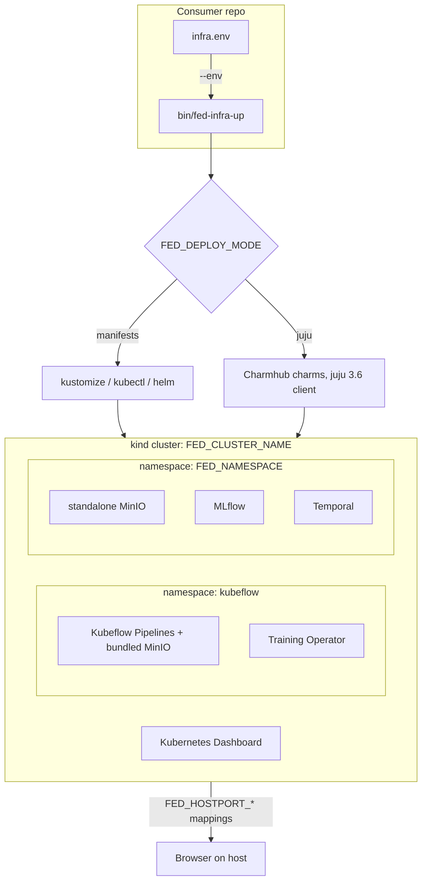
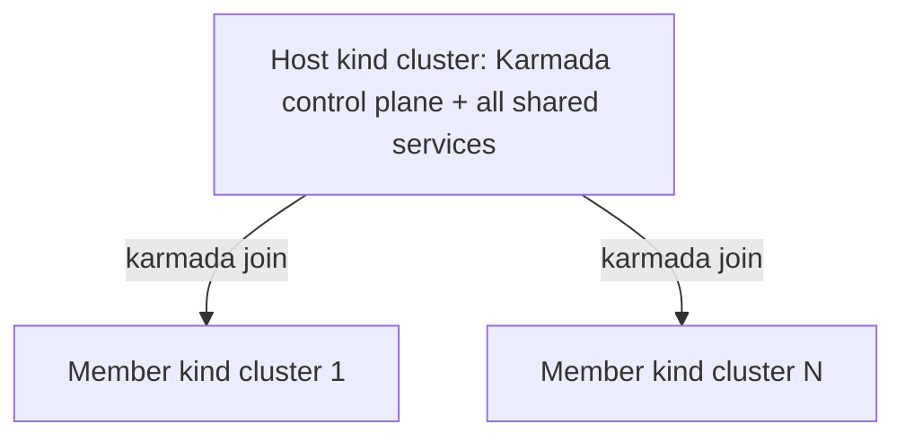

# Fed-Infra (Federated Learning Infrastructure)


A shared Bash library that brings up local Kubernetes development clusters
with kind, Kubeflow Pipelines, the Kubeflow Training Operator, MLflow, MinIO,
Temporal, and the Kubernetes/Karmada Dashboards.

Other repositories consume it as a pinned git submodule. It knows nothing
about any specific consumer (see [Repo agnosticism](#repo-agnosticism)).

## Architecture



Which components exist is driven by `FED_COMPONENTS` (see
[Components](#components)); how they get installed is driven by
`FED_DEPLOY_MODE` (see [Deploy modes](#deploy-modes)).

Under `FED_PROFILE=multi`, fed-infra creates a host cluster plus
`FED_MEMBER_COUNT` member clusters and federates them with Karmada. Shared
services still install on the host only:



## Quick start

```bash
# Bring the cluster and components up (idempotent, safe to re-run)
vendor/fed-infra/bin/fed-infra-up --env infra.env

# Tear everything down
vendor/fed-infra/bin/fed-infra-down --env infra.env
```

All configuration lives in one file, `infra.env`, at the consumer's repo
root. See [Configuration](#configuration). Consumers typically wrap these
commands in their own `setup/install_*.sh` / `setup/teardown_*.sh` scripts
(to build and load their own images first) and expose them as `make` targets.

## Requirements

- **Bash**: targets macOS system Bash 3.2 (no associative arrays, no
  `${var,,}`, no `mapfile`).
- **To bring up a cluster**: `kind`, `kubectl`, `docker`, `envsubst`, and
  `helm` on `PATH`. `helm` is only needed when the `temporal` component runs
  in manifests mode (the default on arm64).
- **Juju mode only**: a `juju` **3.6.x** client. Homebrew installs 4.x, which
  cannot deploy these charms; get 3.6.x from the
  [GitHub releases page](https://github.com/juju/juju/releases).
  `fed_juju_require` checks this and fails with the same guidance.
- **Development**: [bats-core](https://github.com/bats-core/bats-core) and
  [shellcheck](https://www.shellcheck.net/). The test suite stubs all cluster
  tools, so none of the above are needed just to run tests.

## Configuration

`bin/fed-infra-up` and `bin/fed-infra-down` both take
`--env <path/to/infra.env>`. `fed_config_load` sources the file, applies
defaults, and validates it before anything else runs.

Four variables are required: `FED_CLUSTER_NAME`, `FED_NAMESPACE`,
`FED_PROFILE` (`single` or `multi`), and `FED_COMPONENTS`. Everything else
either has a default or is only read when a specific component is enabled.

**Full variable reference: [docs/variables.md](docs/variables.md).**

## Components

`FED_COMPONENTS` is a comma-separated subset of
`kfp,training,minio,mlflow,temporal,karmada,k8s-dashboard,karmada-dashboard`.
Matching is whole-token (`fed_has_component`): order doesn't matter, spaces
around commas are not allowed.

- **`kfp`**: Kubeflow Pipelines at `FED_KFP_VERSION`, into the `kubeflow`
  namespace. Patches core deployments to ARM/kind-friendly images (upstream's
  `gcr.io` images are amd64-only or no longer served), patches KFP's own
  bundled MinIO, waits for rollout, provisions the `mlpipeline` bucket, and
  exposes the UI on `FED_NODEPORT_KFP` / `FED_HOSTPORT_KFP`.
- **`training`**: Kubeflow Training Operator at
  `FED_TRAINING_OPERATOR_VERSION`. Registers the `pytorchjobs.kubeflow.org`
  CRD and waits for it and the operator pod.
- **`minio`**: a *standalone* MinIO (separate from KFP's bundled one) in
  `FED_NAMESPACE`, exposed on `FED_NODEPORT_MINIO_API` /
  `FED_NODEPORT_MINIO_CONSOLE`.
- **`mlflow`**: builds `FED_MLFLOW_IMAGE` locally, loads it into kind,
  deploys the MLflow tracking server into `FED_NAMESPACE`, and ensures
  `FED_S3_BUCKET` exists at `FED_S3_ENDPOINT`. The endpoint can be the
  consumer's own `minio` component or any shared S3-compatible store.
- **`temporal`**: Postgres plus the Temporal server and Web UI in
  `FED_NAMESPACE`, UI exposed on `FED_NODEPORT_TEMPORAL_UI` /
  `FED_HOSTPORT_TEMPORAL_UI`.
- **`karmada`**: only meaningful under `FED_PROFILE=multi`, where it is
  **required**. Validation rejects a `multi` contract without it; the profile
  drives the Karmada steps, so this token is a declaration, not a switch.
  Installs the Karmada control plane on the host cluster, writes its
  kubeconfig to `FED_KARMADA_CONFIG`, and joins the host and every member
  cluster.
- **`k8s-dashboard`**: upstream Kubernetes Dashboard plus a `dashboard-admin`
  ServiceAccount, exposed on `FED_NODEPORT_K8S_DASHBOARD` /
  `FED_HOSTPORT_K8S_DASHBOARD`. Works under either profile. See
  [Dashboard access](#dashboard-access).
- **`karmada-dashboard`**: `multi` only. Installs the Karmada Dashboard on
  the host cluster, wires it to the Karmada control plane, and exposes it on
  `FED_NODEPORT_KARMADA_DASHBOARD` / `FED_HOSTPORT_KARMADA_DASHBOARD`.

Within `fed_up`, components run in a fixed order: create/reuse the kind
cluster → `kfp` install + patches → `training` → `minio` → `mlflow`
(build, load, install) → `k8s-dashboard` → `karmada-dashboard` → load
consumer `FED_IMAGES` → `kfp` wait + bucket + NodePort → `mlflow` bucket →
`minio` NodePort → `k8s-dashboard` NodePort.

Two illustrative `infra.env` shapes (matching `tests/fixtures/*.env`):

- Consumer owns its own MinIO: `FED_COMPONENTS=kfp,training,minio,mlflow`,
  `FED_NAMESPACE` distinct from `kubeflow`, `FED_S3_ENDPOINT` pointing at
  that namespace's `minio-service`.
- Consumer reuses KFP's bundled MinIO: `FED_COMPONENTS=kfp,training,mlflow`
  (no `minio`), `FED_NAMESPACE=kubeflow`,
  `FED_S3_ENDPOINT=minio-service.kubeflow.svc.cluster.local:9000`.

## Deploy modes

`FED_DEPLOY_MODE` picks how `minio`, `mlflow`, `temporal`, `training`, and
`kfp` get installed:

- **`manifests`**: the primary, always-works path of bash/kustomize/Helm
  installs. Runs on any architecture (arm64 included), needs no `juju`.
- **`juju`**: installs the same components as Charmhub charms instead
  (`lib/juju.sh` plus each component's `_install_juju` counterpart), backed
  by `mysql-k8s` (mlflow) and `postgresql-k8s` (temporal). Requires an
  **amd64 Docker daemon**: every charm in this stack is amd64-only on the
  stable channels this project uses. On Apple Silicon that means a dedicated
  x86_64 Colima profile, not the default arm64 one. Also requires the `juju`
  3.6.x client (see [Requirements](#requirements)).
- **`auto`** (default): resolves to `juju` iff
  `docker version --format '{{.Server.Arch}}'` reports `amd64`, otherwise
  `manifests`. kind nodes inherit the Docker *daemon's* architecture, so
  this is the correct signal even when the daemon runs a foreign-arch VM.
  Under `FED_DRY_RUN=1`, `auto` never probes docker (dry run performs no
  side effects, not even reads) and always resolves to `manifests`; set
  `FED_DEPLOY_MODE=juju` explicitly to dry-run the juju command stream.

Mode-specific behavior worth knowing:

- **kfp**: manifests mode runs the upstream kustomize install (the only kfp
  that works on arm64); juju mode deploys the standalone charm family into
  the `kubeflow` model (`kfp-api`/`kfp-ui`/`kfp-persistence`/`kfp-schedwf`/
  `kfp-viewer`/`kfp-viz`/`kfp-metadata-writer` plus `mlmd`, `envoy`,
  `argo-controller`, and kfp's own `kfp-db`/`kfp-minio` backing stores).
- **mlflow needs minio in juju mode**: mlflow-server's artifact store is the
  `minio` charm, wired through the `object-storage` relation.
  `fed_mlflow_install_juju` fails immediately if `minio` is missing from
  `FED_COMPONENTS`. Manifests mode has no such coupling: any S3-compatible
  `FED_S3_ENDPOINT` works.
- **Manifests-only**: `FED_PROFILE=multi` and the two dashboard components
  have no juju equivalent; `FED_DEPLOY_MODE` doesn't affect them.
- **Service names differ by mode**: standalone MinIO is `minio-service`
  under manifests but `minio` under juju; MLflow is `mlflow-service` vs
  `mlflow-server`. The differences live inside `lib/components.sh`; the
  NodePort/hostPort contract a consumer depends on is identical in both
  modes.
- **juju names are derived, never user-set**: cloud
  `fed-<FED_CLUSTER_NAME>-k8s`, controller `fed-<FED_CLUSTER_NAME>`, and
  models named after the namespaces they back: `$FED_NAMESPACE` for
  `minio`/`mlflow`/`temporal`, plus the hardcoded `kubeflow` model when
  `training` is enabled (deduplicated if a consumer sets
  `FED_NAMESPACE=kubeflow`).

## Dashboard access

Both dashboard components bind their ServiceAccount to cluster-admin. This
is a **local-development convenience only**: the dashboards otherwise carry
no usable RBAC of their own, and the binding is what makes token login work.
Never do this on a shared or production cluster; it's acceptable here only
because the target is always an ephemeral local kind cluster.

`fed_dashboard_token <namespace> <service_account>` mints a 24h token
(`kubectl create token`) and prints it on stdout only, never through
`fed_log`, so it can't leak into a redirected log file. It uses the caller's
ambient kubectl context:

```bash
# Kubernetes Dashboard (host cluster context)
fed_dashboard_token "$FED_NAMESPACE" dashboard-admin

# Karmada Dashboard (the SA lives in the Karmada control plane's apiserver)
KUBECONFIG="$FED_KARMADA_CONFIG" fed_dashboard_token karmada-system karmada-admin-sa
```

## Dry run

`FED_DRY_RUN=1` (or `--dry-run`) turns every mutating call (`kind create`,
`kind load`, `docker build`, `kubectl apply`/`patch`/`wait`) into a no-op
that logs what it would have done. Manifests are rendered with `envsubst`
into `FED_RENDER_DIR/<label>.yaml` instead of applied, so they can be
inspected or diffed against `tests/golden/`. `FED_RENDER_DIR` must be set in
this mode. `karmada` and `karmada-dashboard` have no local templates, so
they render nothing under dry-run.

```bash
vendor/fed-infra/bin/fed-infra-up \
  --env infra.env \
  --dry-run \
  --render-dir /tmp/fed-infra-render

ls /tmp/fed-infra-render
```

## Development

```bash
make check   # lint (shellcheck) + test (bats), includes the agnosticism guard
make lint    # shellcheck only
make test    # bats only
```

Every function is prefixed `fed_` and must be idempotent (safe to run
repeatedly). Environment variables use the `FED_` prefix. The bats suite
lives in `tests/`, with command stubs under `tests/stubs/`, fixture
`infra.env` files under `tests/fixtures/`, and golden rendered manifests
under `tests/golden/`.

## Consumers: pinning and bumping the SHA

Consumers vendor this repo as a git submodule at `vendor/fed-infra`, pinned
to an exact commit SHA (never a branch or tag), so a change here never
silently changes a consumer's behavior until that consumer opts in.

```bash
# Initial checkout / after cloning a consumer repo
git submodule update --init --recursive

# Bump a consumer to a newer fed-infra commit
cd vendor/fed-infra
git fetch origin
git checkout <new-sha>
cd ../..
git add vendor/fed-infra
git commit -m "chore: bump vendor/fed-infra to <short-sha> (<why>)"

# Check what's currently pinned
git submodule status vendor/fed-infra
```

In `git submodule status`: a leading space means the working tree matches
the pinned SHA; `+` means it's checked out at some other commit; `-` means
the submodule hasn't been initialized yet.

## Repo agnosticism

fed-infra must never contain a consumer-specific string: no repo name,
product name, or business identifier, this README included (the examples
above use the same placeholder names as the test fixtures).
`tests/agnostic.bats` enforces this by grepping the whole repository for
known consumer identifiers and failing `make check` on any hit.

The reason: fed-infra is vendored unmodified by multiple unrelated projects.
Every point of contact with a consumer must flow through data (`infra.env`
and `FED_*` variables), never a hardcoded string or conditional. If the
library special-cased one consumer, a fix for that consumer could silently
change behavior for every other consumer on the same pinned commit.

## Nightly cross-repo contract check

A nightly-only `consumer-contracts` job in `.github/workflows/ci.yml`
fetches each consumer's real `infra.env` contracts and renders them against
this repo's current `main`, so a library change that breaks a consumer
fails here, in the repo that caused it, instead of surfacing days later in
that consumer's submodule bump.

The consumer list can't live in the workflow file (see
[Repo agnosticism](#repo-agnosticism)), so it's a repository variable:

- **Name**: `CONSUMER_CONTRACT_REPOS` (Settings → Secrets and variables →
  Actions → Variables).
- **Shape**: a JSON array of `{"repo": "<owner>/<name>", "envs":
  "<space-separated env files>"}` objects:

  ```json
  [
    { "repo": "OWNER/CONSUMER_ONE", "envs": "infra.env infra.env.multi" },
    { "repo": "OWNER/CONSUMER_TWO", "envs": "infra.env infra.env.multi" }
  ]
  ```

- **If unset**: the job shows as *skipped*, not failed; forks simply don't
  get the check. It's not needed for `make check` or per-PR CI.
- **On the origin repo**: a sibling `consumer-contracts-guard` job fails the
  workflow if the variable is unset, so an accidentally cleared variable
  can't silently degrade the nightly run to a green no-op.
